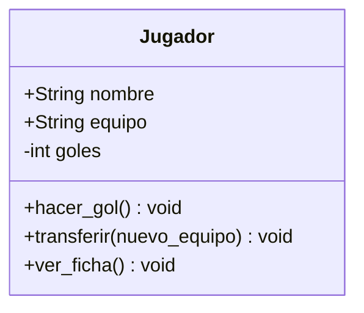

### Que entendi sobre las relaciones?
Las relaciones en UML sirven para conectar diferentes clases y mostrar cómo interactúan entre sí por ej si un Jugador pertenece a un Equipo.

### Mi clase tiene relaciones?
No mi clase Jugador no tiene relaciones con otras clases porque es un objeto independiente.
